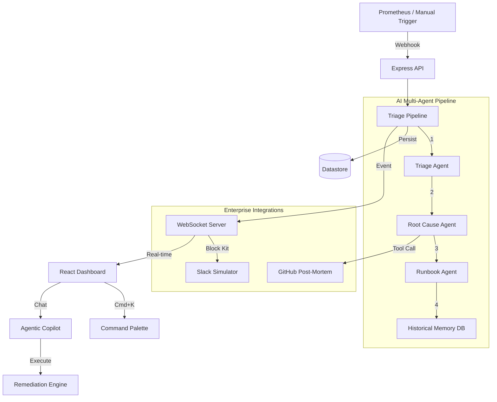

# SecureOps Sync 🛡️
> AI-Powered Incident Response Platform built on Lemma SDK


SecureOps Sync transforms chaotic raw alerts into structured, actionable incidents in seconds. Using a multi-agent AI pipeline, it automatically triages alerts, executes remediation actions, visualizes blast radius, and generates post-mortems—acting as a fully integrated operations copilot.

## 🎯 The Pipeline
```txt
Raw Alert → AI Triage → Root Cause → Runbook Gen → Severity Routing → Agentic Action → Dashboard + Copilot → Root Cause → Runbook Gen → Severity Routing → Agentic Action → Dashboard + Copilot
```

## 🏗️ Architecture



## ✨ Key Features

### 🧠 True Agentic Action
The Copilot doesn't just suggest fixes—it executes them. Using tool-calling, the AI can restart services, scale up deployments, and auto-resolve incidents on command.

### 📚 Historical Memory & Vector Search
Uses vector embeddings to find similar past incidents. Instantly answers: "Have we seen this before?" with average resolution times and best known fixes.

### 🗺️ System Topology & Predictive Cascade
Visual graph of infrastructure. When an incident occurs, affected nodes pulse red. The AI also predicts cascade failures, highlighting dependent services in yellow before they break.

### ⚡ Enterprise Integrations
- **Prometheus:** Ingests standard Alertmanager webhooks out-of-the-box.
- **Slack:** Formats incidents into Block Kit and accepts `/secureops ack` slash commands.
- **GitHub:** One-click push of AI-generated post-mortems as structured GitHub Issues.

### 📈 Executive Dashboard & Real-Time Ops
Live activity feeds powered by WebSockets, auto-escalation schedulers, and an executive view tracking MTTR, reliability scores, and revenue impact.

## 🛠️ Tech Stack
- **AI/LLM**: Lemma SDK (GPT-4o-mini, Vector Embeddings, Tool Calling)
- **Backend**: Node.js, Express, Socket.io
- **Frontend**: React, Vite, React Flow, TailwindCSS, Sonner, Cmdk
- **Infra**: Docker, Docker Compose

## 🚀 Local Setup

### Prerequisites
- Node.js 18+
- Lemma API Key
- Docker (Optional, for containerized setup)

### Quick Start (Docker Compose)
1. Clone the repo
2. Copy `.env.example` to `.env` and fill in your keys
3. Run:
```bash
docker-compose up --build
```
4. Access the app at `http://localhost:8080`

### Manual Setup (Development)

#### 1. Backend
```bash
cd backend
npm install
# Create .env with LEMMA_API_KEY=your_key_here
npm run dev
```

#### 2. Frontend
```bash
cd Frontend
npm install
npm run dev
```

## 🎛️ Demo Usage
1. Open the app at `http://localhost:5173` (or `8080` for Docker)
2. Press `Cmd + K` (or `Ctrl + K`) to open the Command Palette.
3. Select "💣 Trigger Chaos: DB Pool Exhausted"
4. Watch the AI pipeline process the incident in real-time.
5. Open the Incident Copilot and type: *"Scale up the payments api"*
6. Watch the AI execute the tool and auto-resolve the incident.